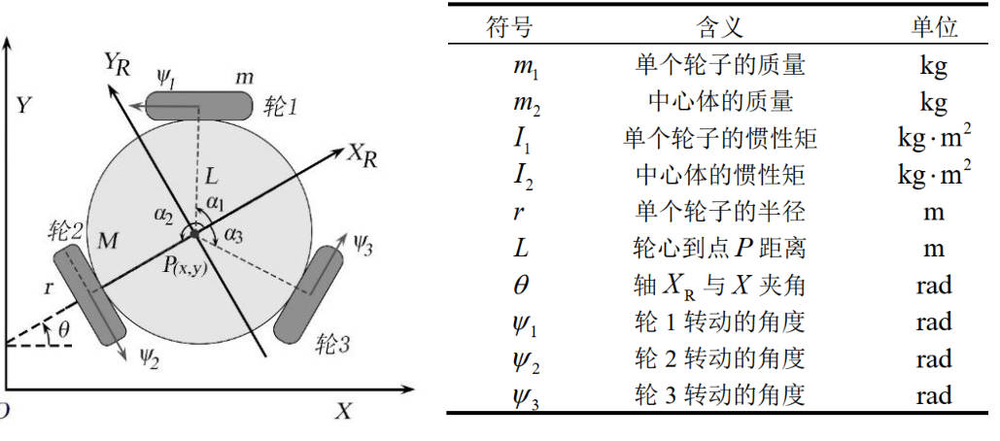
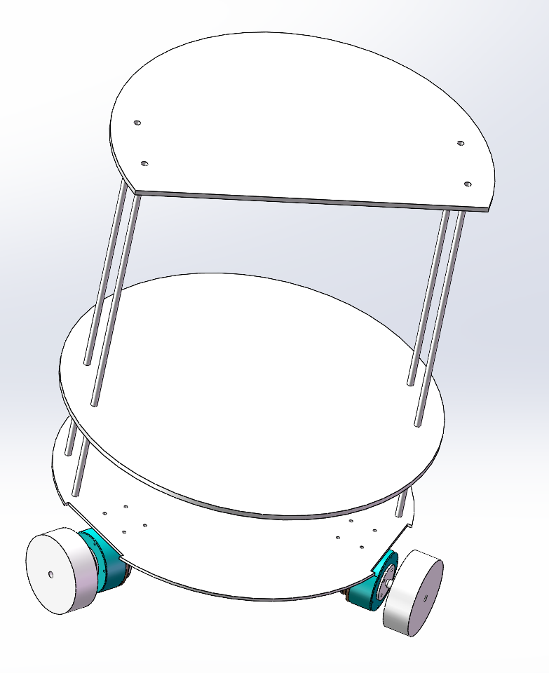
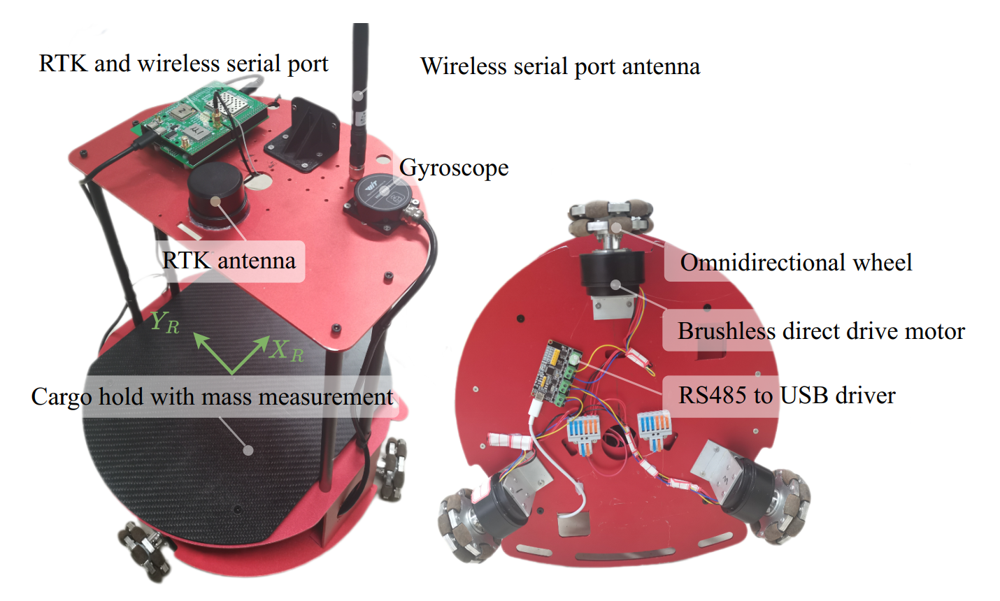

# OmniWheelRobotV2

三轮全向机器人的设计和仿真

# 运动学模型和动力学模型

## 物理量定义

## 实物尺寸

- m1：0.126 kg
- I1：8.86E-5 kgm^2
- m2: 6.274 kg
- I2: 0.096E-5 kgm^2
- r: 0.0375 m
- L: 0.175 m

## 运动学模型

$$
\dot{x}\sin\left(\theta+\pi/3\right)-\dot{y}\cos\left(\theta+\pi/3\right)-\dot{\theta}L-\dot{\psi}_1r=0
$$

$$
\dot{y}\cos\theta-\dot{x}\sin\theta-\dot{\theta}L-\dot{\psi}_2r=0
$$

$$
\dot{x}\sin\left(\theta-\pi/3\right)-\dot{y}\cos\left(\theta-\pi/3\right)-\dot{\theta}L-\dot{\psi}_3r=0
$$

## 动力学模型

$$
\ddot{q}_1=A_1^{-1}b-KX^{-1}\left(F_2+K^\top M_{11}A_1^{-1}b-K^\top\left(F_1+\tau_f\right)\right)
$$

$$
\ddot{q}_2=X^{-1}\left(F_2+K^\top M_{11}A_1^{-1}b-K^\top\left(F_1+\tau_f\right)\right)
$$

（具体每个变量的定义参考文献 [2]II.B 部分）

## 参考文献

[1] 赵睿英, 余进, 冯艳丽, 等. 机械系统动力学 Rosenberg 嵌入法的扩展与解耦: 一阶约束与二阶约束的整合[J]. 机械工程学报, 2023, 59(9): 101-115.

[2] Hankun Jiang, et. al. "Trajectory Tracking Control of Three Wheeled Omnidirectional Robot in Narrow Spaces with Uncertainty", IEEE Transactions on Intelligent Vehicles, Under Review.

# 机械建模和硬件选型

## 机械建模和实物图

- 机械建模图

- 实物图

## 硬件选型

- 电机：领控科技MF6015v2

  > 参考手册：
  >
  >  [MF伺服电机用户手册.pdf](assets/motor/MF伺服电机用户手册.pdf) ， [产品手册.pdf](assets/motor/产品手册.pdf) ， [485指令手册.pdf](assets/motor/485指令手册.pdf)
  >
  > 上位机系统：
  >
  >  [LK_motor_tool_V2_35_.exe](assets/motor/LK_motor_tool_V2_35_.exe)

- 陀螺仪：维特智能WHT101CT

  >参考手册：
  >
  >https://wit-motion.yuque.com/wumwnr/docs/lvqyh7?singleDoc#%20%E3%80%8AHWT101CT-TTL/232%E4%BA%A7%E5%93%81%E8%B5%84%E6%96%99%E3%80%8B

- 定位系统：BIT982（自制设备，核心为UM982定位芯片和900数传芯片）

  > 参考手册和驱动：
  >
  > https://github.com/sunshineharry/UM982Driver

# 核心Topic和Service

# 使用教程
